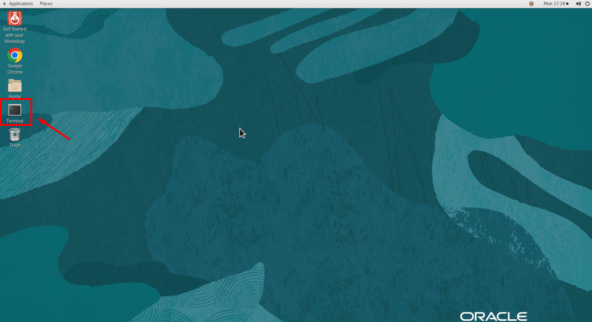
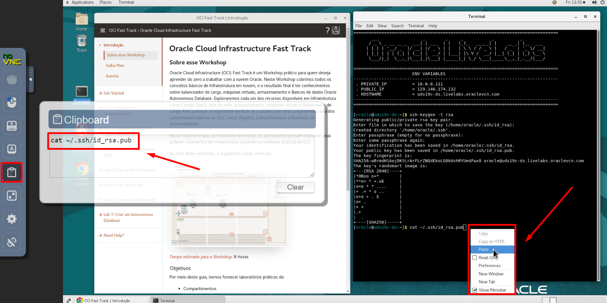
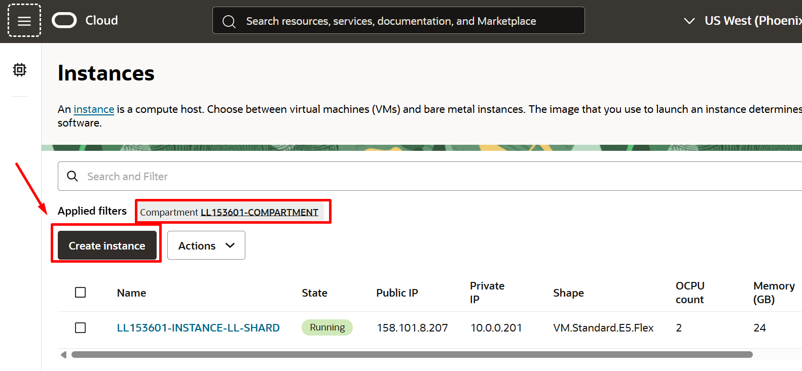

# Creación de maquinas virtuales

Esta sección contiene 2 partes:
- [Máquinas Virtuales](#aprendamos-un-poco-sobre-las-máquinas-virtuales)
- [Laboratorio 3](#laboratorio-3-creación-de-máquinas-virtuales)

## Aprendamos un poco sobre las máquinas virtuales 

Oracle Cloud Infrastructure permite aprovisionar y gestionar hosts de cómputo conocidos como instancias. Puedes crear instancias según sea necesario para satisfacer tus requisitos de cómputo y aplicaciones. Después de crear una instancia, puedes acceder a ella de forma segura desde tu computadora, reiniciarla, adjuntar y desvincular volúmenes y cerrarla cuando ya no la necesites. Esto proporciona flexibilidad y escalabilidad para satisfacer las necesidades de tu infraestructura de TI en la nube.

Para saber más, puedes consultar la documentación de OCI 🤓➡️ https://docs.oracle.com/en-us/iaas/Content/Compute/Concepts/computeoverview.htm

## Laboratorio 3: Creación de máquinas virtuales

En este laboratorio, aprenderás a crear 2 máquinas virtuales Linux.

_**Tiempo estimado para el laboratorio**_: 35 minutos

Objetivos:
- Crear un par de claves SSH en OCI Cloud Shell
- Crear 2 máquinas virtuales (VM) Linux
- Acceder a las instancias

**Cada máquina virtual debe estar en un AD diferente**. Para ellos seguiremos los siguientes pasos:
- [Paso 1: Crear un par de llaves SSH](#paso-1-crear-un-par-de-llaves-ssh)
- [Paso 2: Crear 2 máquinas virtuales Oracle Linux](#paso-2-crear-2-máquinas-virtuales-oracle-linux)
- [Paso 3: Acceder a la VM por el terminal](#paso-3-acceder-a-la-vm-por-el-terminal)

### Paso 1: Crear un par de llaves SSH

1. Acceda al escritorio remoto en su VCN haciendo click en <Launch Remote Desktop> o simplemente acceda a la pestaña <NoVNC> si ya está abierta. 

 
 
 
 Si la terminal no está abierta, puede abrirla nuevamente.
 
 
 > **Nota:** Use el Portapapeles de NoVNC para facilitar la copia dentro y fuera de la Terminal. De ahora en adelante, siempre que necesites copiar/pegar algo a la Terminal, y también desde la Terminal hacia afuera, usa el Portapapeles.
 
 

2. Para crear el par de llaves usamos el comando:

   ```
   ssh-keygen -t rsa
   ```
   - Mantenga el nombre original de la llave (id_rsa) aprentando enter
   - El campo "Key Passphrase" es opcional
   - Click "ENTER" nuevamente para finalizar la creación

   

3. Para ver el contenido de la llave pública, ejecuta este comando:
   
   ```
   cat ~/.ssh/id_rsa.pub
   ```
  > **Nota:** Si no sabes la combinación de teclas para el símbolo "~" (virgulilla), busca el símbolo y copialo en el área de transferencia del Escritorio Remoto. Luego de ello, pégalo dentro del terminal usando _clic derecho + pegar_. Puedes hacer esto para facilitar el copiado/pegado de texto entre tu escritorio y el escritorio remoto.

   

  * Seleccione el contenido en la terminal y utilice el botón derecho del mouse para copiarlo.
    

  * Seleccione, copie y pegue el cnotenido de esta llave en el Portapapeles/Clipboard como se muestra en la imagen de abajo, y si es posible guárdelo en un bloc de notas, ya que lo usaremos para crear las máquinas virtuales Linux.
    

    
  _Para la creación de la VM, usaremos una llave pública y para la conexión, usaremos la llave privada_
  
     
### Paso 2: Crear 2 máquinas virtuales Oracle Linux

1. Volviendo a la consola de OCI, en el menú principal, haga click en: Compute > Instances , a continuación "Create Instance"
   > **Nota:** Verificar que su compartimiento esté seleccionado antes de crear la instancia

   
   
   

   > **Nota:** Antes de crear las instancias, verifique en que AD se creo su máquina NoVNC y luego use los otros 2 AD para crear las máquinas virtuales
   
   > **Ejemplo:** en la imagen a continuación, puede ver que la máquina NoVNC se creó en AD-2, esto significa que aún puede usar los AD-1 y AD-3 para crear cada una de las máquinas. Este diagraa solo se aplica al entorno sandbox del taller LiveLabs. En entornos reales, puede crear recursos en cualquier AD, siempre que se cumplan los límites y políticas necesarias.

   

    Estos serán los datos de tu instancia:
    * Nombre de tu instancia: VM-OracleLinux-1
    * Availability Domain (AD): Elija uno que no esté siendo utilizado por la VM NoVNC
    * Sistema Operativo: Oracle Linux 8
    * Tipo de Instancia: Virtual Machine
    * Instance Shape: AMD VM.Standard.E4.Flex
    * Elija llave SSH: Insertar archivo de clave pública SSH (.pub)
    * Virtual Cloud Network Copartment: "Su Compartimento"
    * Virtual Cloud Network: "Tu VCN"
    * Subnet Compartment: "Tu Compartimento" (Creado por defecto en el ambiente)
    * Subnet: Subred Pública

     Llena los datos según lo indicado. **Recuerda que ya tienes un compartment creado por defecto. Debes elegir ese** 🤓☝️
   
      

  2. Después de expandir las opciones de Shapes and Network, ingrese los datos necesarios para concluir el proceso de creación
      
  

4. Elige la imagen y el shape de tu MV. Haz clic en _"Change Image"_ para cambiar la imagen y en _"Change shape"_ para cambiar el shape

   

   - Cambiar imagen
     
     

    - Cambiar shape

     
     

   _Resultado_

    

5. Selecciona la VCN y la subnet pública creadas por defecto, y eliga la opción de _"Asignar una dirección IPv4 pública"_

   

6. Colocamos la llave pública SSH creada en el paso 3 y clic en _"Create"_

   

  Tu instancia tomará unos minutos en crearse. Si esta todo OK🤞, quedará como la imagen ⤵️
  
  

6. Realizamos los mismos pasos para crear la MV2. La crearemos en el AD restante.
   Estos serán los datos de tu instancia:
    * Nombre de tu instancia: VM-OracleLinux-AD3
    * Dominio de Disponibilidad: AD 3
    * Sistema Operativo: Oracle Linux 7.9
    * Tipo de Instancia: Máquina Virtual
    * Forma de la Instancia: AMD VM.Standard.E4.Flex
    * Elija el Archivo de Clave SSH: Inserta el archivo de clave pública SSH (.pub)
    * Compartimento de la Red de Nube Virtual: "Tu Compartimento"
    * Red de Nube Virtual: "Tu VCN"
    * Compartimento de Subred: "Tu Compartimento"
    * Subred: Subred Pública

  ### Paso 3: Acceder a la VM por el terminal

  1. Copiamos la IP privada de una nuestras instancias
     
     

  2. Volvemos al Escritorio Remoto, y en el terminal, hacemos la conexión con la máquina creada usando el siguiente comando

     ```
     ssh opc@<ip privado da VM>
     ```

     * El usuario por defecto de las instancias Linux es OPC

     

     **Super! Continuemos con el siguiente laboratorio 🤩👉 [Laboratorio 4 - Block Volume](https://github.com/kapvar9/oci-FastTrack-infraestructura/blob/main/Lab5-ObjectStorage/Readme.md)**
   
   
