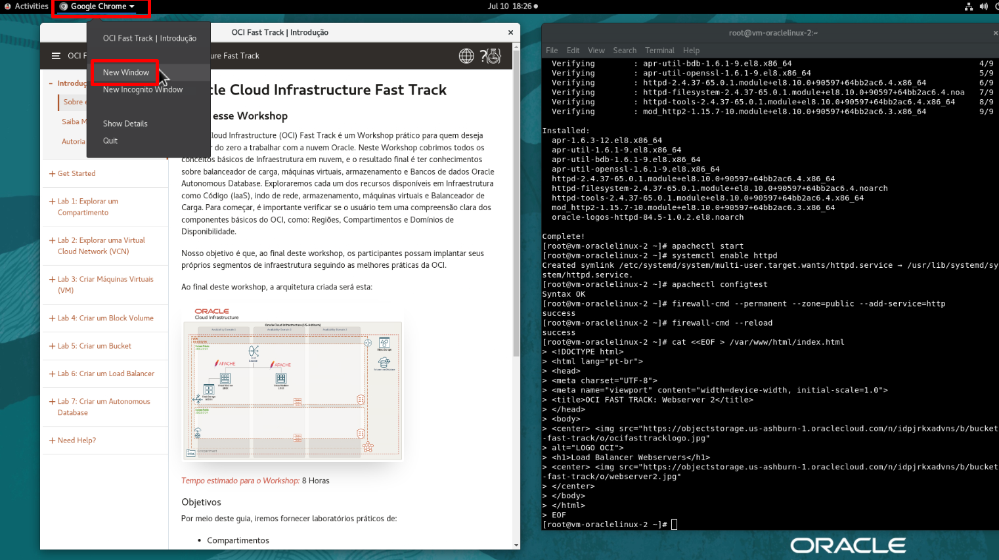
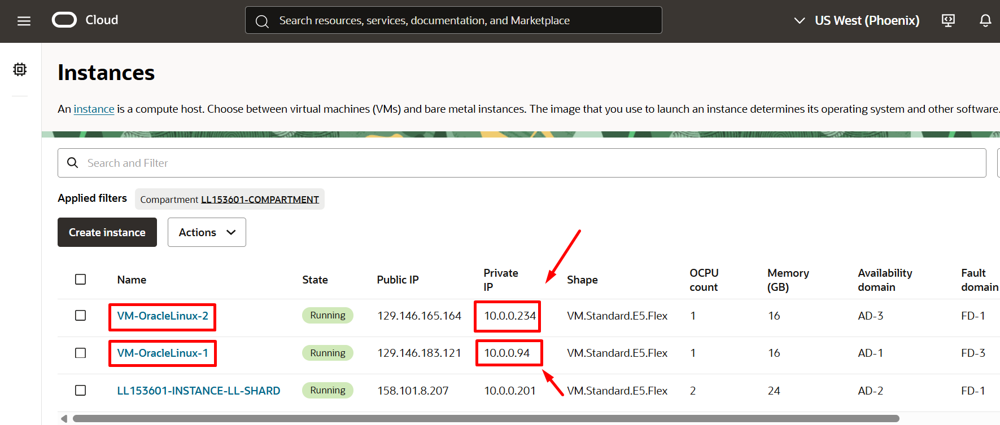
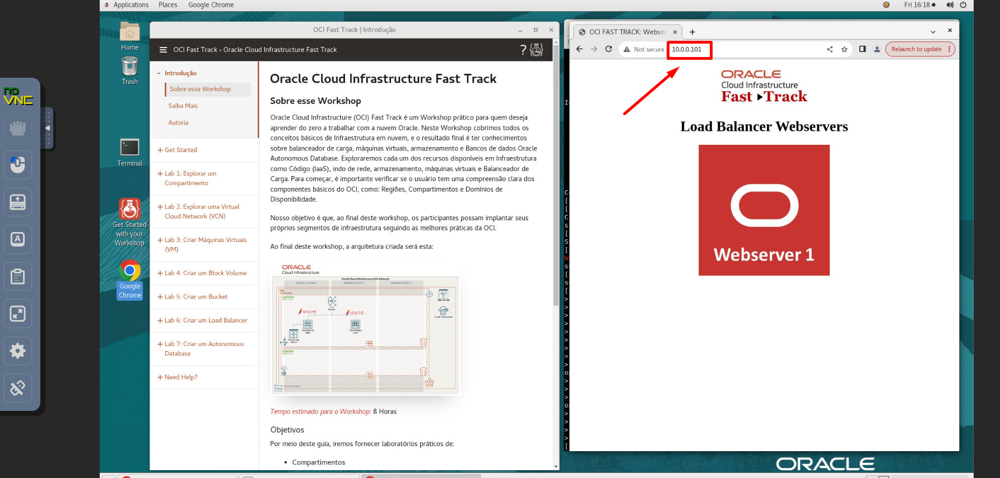
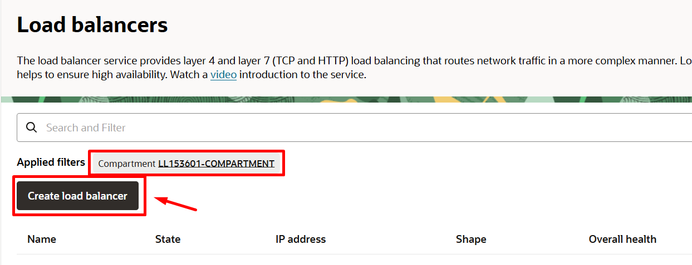
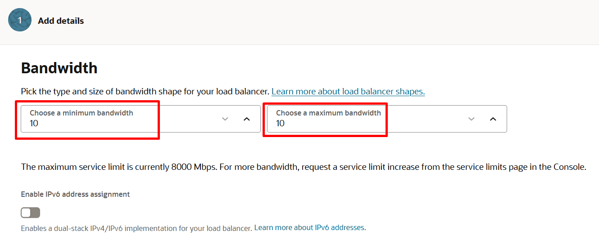
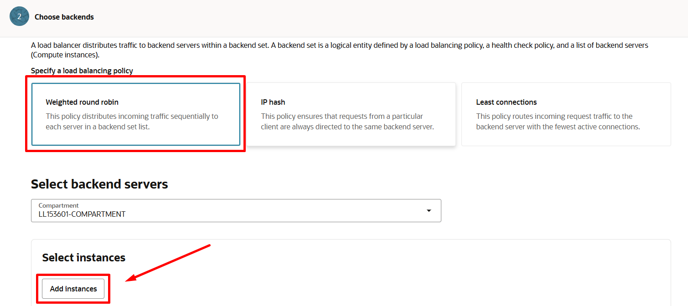
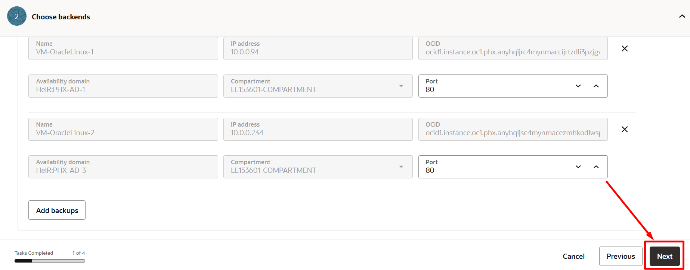
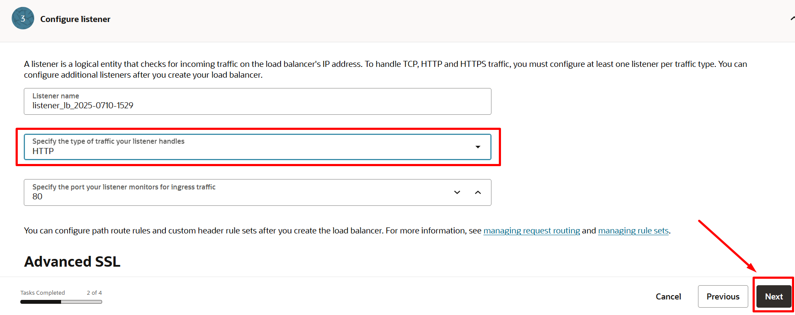
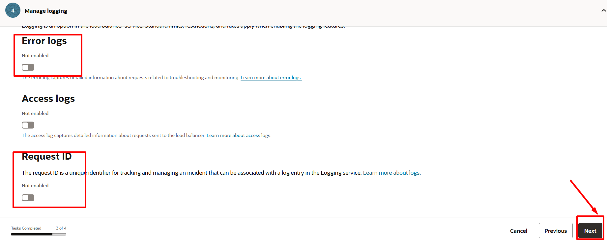
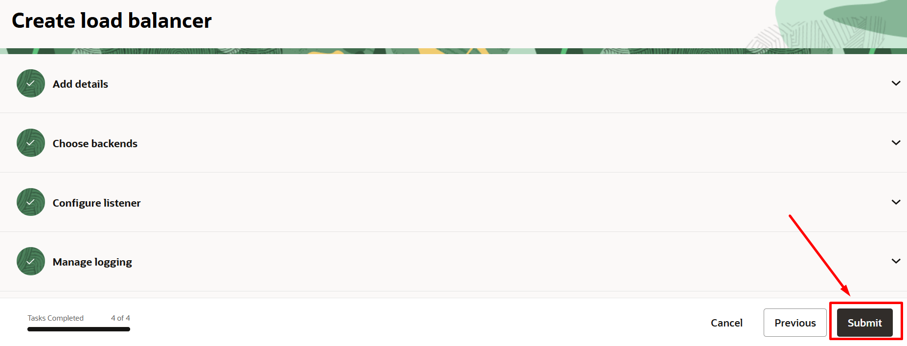

# Crear un Load Balancer
## Introducción
### Overview

El servicio Oracle Cloud Infrastructure Load Balancing proporciona distribución automatizada del tráfico desde un punto de entrada a varios servidores accesibles desde su red de nube virtual (VCN). El servicio ofrece un balanceador de carga con su elección de dirección IP pública o privada y ancho de banda aprovisionado.

El servicio Load Balancer le permite crear un balanceador de carga público o privado en su VCN. Un balanceador de carga público tiene una dirección IP pública a la que se puede acceder desde Internet. Un balanceador de carga privado tiene una dirección IP de la subred de alojamiento, que solo es visible en su VCN. Puede configurar varias direcciones IP para una dirección IP para equilibrar la carga del tráfico de Capa 4 y Capa 7 (TCP y HTTP). Los balanceadores de carga públicos y privados pueden enrutar el tráfico de datos a cualquier servidor backend al que se pueda acceder desde la VCN.

Su Load Balancer tiene un backend definido para enrutar el tráfico entrante a sus instancias informáticas. El conjunto de backend es una entidad lógica que incluye:

- Una política de equilibrio de carga.
- Una política de health check.
- Manejo SSL opcional.
- Configuración opcional de persistencia de sesión.

### Conceptos de equilibrio de carga
- **Backend Server:** Un servidor de aplicaciones responsable de generar contenido en respuesta al tráfico TCP o HTTP entrante. Normalmente, los servidores de aplicaciones se identifican con una combinación única de puerto y dirección IPv4 superpuesta (privada), por ejemplo, 10.10.10.1:8080 y 10.10.10.2:8080.
- **Backed Set:** Una entidad lógica definida por una lista de servidores back-end, una política de equilibrio de carga y una política de verificación de estado. La configuración SSL es opcional. El conjunto de backend determina cómo Load Balancer dirige el tráfico a la colección de servidores de backend.
- **Certificados:** Si utiliza HTTPS o SSL para su *Listener*, debe asociar un certificado de servidor SSL (X.509) con su Load Balancer. Un certificado permite a Load Balancer finalizar la conexión y descifrar las solicitudes entrantes antes de pasarlas a los servidores back-end.
- **Heath check o verificación de estado:** Una prueba para confirmar la disponibilidad de los servidores back-end. Una verificación de estado puede ser una solicitud o un intento de conexión. Según el intervalo de tiempo que especifique, Load Balancer aplica la política de comprobación de estado para supervisar continuamente los servidores back-end. Si un servidor no supera la verificación de estado, Load Balancer sacará temporalmente el servidor de su rotación. Si el servidor pasa posteriormente la verificación de estado, Load Balancer lo devuelve a la rotación.


En este laboratorio aprenderá cómo trabajar con Load Balancer dentro de Oracle Cloud Infrastructure


*Tiempo estimado para este laboratorio: 25 minutos*.

### Objetivos

- Cree un servicio privado de Load Balancer, con 2 servidores back-end que ejecuten aplicaciones Apache.

Antes de comenzar a crear el servicio Load Balancer, tenga en cuenta que hay algunas tareas importantes que completar. Para que Load Balancer pruebe cualquier “servicio”, es necesario instalar una aplicación (Apache) en servidores Linux.

### Pasos
- [Tarea 1: Instalar la aplicación de Apache en un servidor Linux](#tarea-1-instalar-la-aplicación-de-apache-en-un-servidor-linux)
- [Tarea 2: Crear una aplicación en Alta Disponibilidad (HA) con un Load Balancer y 2 servidores web](#tarea-2-crear-una-aplicación-en-alta-disponibilidad-ha-con-un-load-balancer-y-2-servidores-web)
- [Probando nuestro Load Balancer](#probando-nuestro-load-balancer)

### Tarea 1: Instalar la aplicación de Apache en un servidor Linux.

1. Instalar la aplicación de Apache Server en cada servidor.
   
   a. Conéctese al host de Linux (VM-OracleLinux-1)  utilizando el usuario opc a través de NoVNC, recuerde como encontrar la IP privada.

      
  
   ```sh
   ssh opc@<ip privada vm> 
   ```      
   b. Una vez conectado, cambie su usuario a ROOT con el comando:
   ```sh
   sudo su – 
   ```
   c. Instale el paquete Apache en el sistema operativo
   ```sh
   sudo yum install httpd -y
   ```
   d. Inicie la aplicación Apache
   ```sh
   sudo apachectl start
   ```
   f. Configure el firewall localhost para permitir el tráfico de Apache; para ello utilice los siguientes comandos en Linux:
   ```sh
   sudo systemctl enable httpd
   sudo apachectl configtest
   sudo firewall-cmd --permanent --zone=public --add-service=http
   sudo firewall-cmd --reload
   ```
   g. En **la primera instancia de computo** utilizada en la interfaz web (VM-OracleLinux-1), cree/edite el archivo **"index.html"**. Utilice el siguiente comando como usuario ROOT:
       
           **Nota: Primero copie la primera línea de código y péguela. Luego copie el cuerpo del código a </html> y péguelo. Por último, copie la última línea y péguela.**
       
               cat <<EOF > /var/www/html/index.html
               <!DOCTYPE html>
               <html lang="pt-br">
               <head>
               <meta charset="UTF-8">
               <meta name="viewport" content="width=device-width, initial-scale=1.0">
               <title>OCI FAST TRACK: Webserver 1</title>
               </head>
               <body>
               <center> 
               <h1>Load Balancer Webservers</h1>
               <center> 
               </body>
               </html>
               EOF
               
        
3. En **la segunda instancia** repetirás los pasos anteriores, del **(a) al (f)**, en la segunda instancia de computo (VM-OracleLinux-2) cree/edite el archivo **"index.html"** usando el siguiente comando con el usuario **ROOT:**
**Nota: Primero copie la primera línea de código y péguela. Luego copie el cuerpo del código a </html> y péguelo. Por último, copie la última línea y péguela.**
    ```sh
    cat <<EOF > /var/www/html/index.html  
    <!DOCTYPE html>
    <html lang="pt-br">
    <head>
    <meta charset="UTF-8">
    <meta name="viewport" content="width=device-width, initial-scale=1.0">
    <title>OCI FAST TRACK: Webserver 2</title>
    </head>
    <body>
    <center> 
    <h1>Load Balancer Webservers</h1>
    <center> 
    </body>
    </html>
    EOF
    ```
   

4.	Pruebe el comportamiento de Apache, todo lo que necesita hacer es usar la **IP privada de la instancia de computo** (VM-OracleLinux-AD1) en el navegador web VNC para ver si aparece la página de inicio de Apache.<br>

<br>

Copiar las IP privadas de las VMs VM-OracleLinux-1 y VM-OracleLinux-2
 


Péguelo en el navegador NoVNC y vea el resultado:
 


Si todo está bien, puede probar la instalación de Apache en la segunda VM (VM-OracleLinux-2). Todo lo que necesita hacer es usar la dirección IP privada de la segunda instancia en el navegador noVNC y probablemente obtendrá un resultado similar al de la imagen anterior.

**IMPORTANTE**: asegúrese de iniciar la creación del Load Balancer solo después de que ambas llamadas en Apache estén funcionando.

Esto es importante porque si crea el balanceador de carga sin un servicio disponible, el balanceador de carga se creará en el estado "Error".

Nuestro objetivo es crear el servicio Load Balancer solo después de que ambos servidores Apache se estén ejecutando, de modo que el servicio Load Balancer tenga un estado "listo" y esté listo para ser probado.

### Tarea 2: Crear una aplicación en Alta Disponibilidad (HA) con un Load Balancer y 2 servidores web.
1.	Para acceder a la interfaz de Load Balancer, una vez más, comencemos desde “Menú principal > Networking > Load Balancers” <br>


Posteriormente haga clic sobre "Create Load Balancer" <br>



2. La pantalla de creación del Load Balancer es una plantilla basada en un asistente, donde se le guiará a través del proceso a través de la interfaz. En la pantalla principal, proporcionará la siguiente información:
- **Nombre**: lb-apache
- **Tipo de visibilidad:** Privado
- **Ancho de banda:** 10Mbps
- **VCN:** <Seleccione su VCN>
- **Subred:** <Seleccione su subred privada>
*Elija la subred, la misma subred donde se crearon sus instancias de computo*<br>
 <br>
 <br>
 <br>
3.	Establezca la política del Load Balancer y agregue los servidores backend. Para agregar servidores backend, haga clic en el botón azul **"Add Instances"** <br>



4. Inserte los servidores del conjunto de backend (sus dos máquinas virtuales Linux):

 <br>
 <br>


5. Como último paso, defina el tipo de tráfico que se manejará. <br>

 <br>
 <br>
 <br>

Una vez completado el proceso de creación, tendrás la siguiente información: <br>

 <br>

#### Probando nuestro Load Balancer

6. Para simular un entorno de aplicación, llamaremos a la IP Privada del Load Balancer (para encontrar la IP privada vea el ejemplo en la imagen anterior) en el navegador NoVNC y luego dirigirá el tráfico a las 2 VMs Linux previamente creadas y agregadas como backends del Load Balancer.
*Para obtener resultados diferentes de las llamadas del Load Balancer, agregue contenido diferente al archivo Index.html en cada cálculo.*
 <br>
7. Utilice la IP privada del balanceador de carga en el navegador noVNC para ver que su aplicación se dirija a los 2 servidores con diferentes respuestas en el archivo **index.html.**

**Super! Continuemos con el siguiente laboratorio 🤩👉 [Laboratorio 7 - Autonomous Database](../../Lab7-AutonomousDB/Readme.md)**

   
